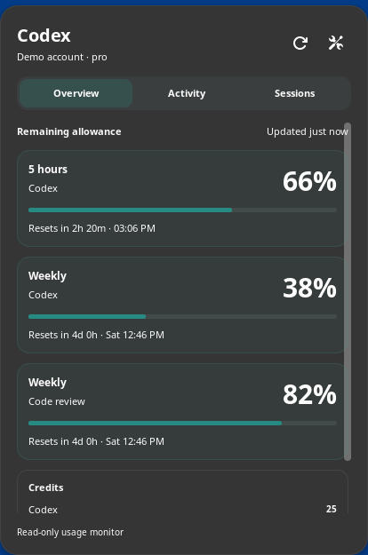

# Codex Usage Monitor

A GNOME companion for Codex: account quotas, reset times, activity, and recent sessions
in your desktop panel, with an editor for Codex's native terminal footer.



The interface is original. Selected history, notification, and GNOME foundations come
from [Claude Usage Tracker for Linux](https://github.com/TheophileDiot/Claude-Usage-Tracker-Linux).
See [NOTICE](NOTICE) for attribution.

## Requirements

- GNOME Shell **46**; later versions are not yet advertised or qualified.
- Codex CLI **0.153.4 or newer**, signed in for account quota/activity data.
- GJS, Libadwaita, GLib schema tools, and `gnome-extensions`.
- Python 3 for test fixtures; Xvfb for the optional preferences test.

The extension uses the installed Codex CLI over a private stdio connection. It adds no
runtime libraries or renderer to Codex. NVM installations are discovered automatically;
Preferences also accepts an explicit executable and Codex home directory.

## Build and install

From this checkout:

```sh
make pack
gnome-extensions install --force dist/codex-usage-monitor@theophilediot.github.io.shell-extension.zip
```

On Wayland, log out and back in so GNOME discovers a newly installed extension. On X11,
restart GNOME Shell with Alt+F2, `r`, Enter. Then enable **Codex Usage Monitor** using the
Extensions application or:

```sh
gnome-extensions enable codex-usage-monitor@theophilediot.github.io
```

Open settings from the popup's preferences button. An empty Codex home uses `CODEX_HOME`
or `~/.codex`. Confirm edited connection paths with their checkmark.

## What it shows

- **Panel:** remaining short-window and weekly percentages from the main Codex bucket.
  A missing main window is omitted; model-specific windows stay separately named in Overview.
- **Overview:** all returned quota windows, reset countdowns and local times, supplied
  credit balances, spending limits, and available reset-credit counts.
- **Activity:** a local 24-hour quota chart, daily token activity, and available account
  summaries. Seven days of percentage samples are retained. Gaps are not zero usage.
- **Sessions:** ten recent records in the selected Codex home, with recorded model,
  reasoning, project, and last activity. Optional token/credit/cost details appear when
  returned by Codex. These records do not indicate which terminals are currently active.

Quotas refresh every minute by default, with backoff on failures. Activity is cached for
15 minutes; its Refresh button fetches immediately. Last successful snapshots stay visible
with their freshness state while the extension remains enabled. After re-enable, fresh
account data identifies which saved history to load.

Notifications at 25%, 10%, and 0% remaining can be toggled individually. The first snapshot
sets a quiet baseline, and subsequent crossings notify once per reset window.

## Native Codex footer

The **Codex footer** preferences page provides 29 native fields, ordering controls,
Focused/Balanced/Detailed presets, native theme colors, and sample-width previews.
Balanced keeps quota and context information first, followed by model/reasoning, project,
and branch. A separate title preset adds activity, project, branch, and thread title.

**Apply to Codex** updates only the selected native settings through Codex's versioned
configuration API. **Restore** reinstates original values while preserving subsequent user
edits. A private recovery journal and exclusive transaction lock protect interrupted or
overlapping updates. Your existing syntax theme and unrelated configuration are preserved.
Start a new Codex session if an existing terminal does not pick up the change.

Standard Codex controls its footer rendering: theme colors are supported, while custom
bars, reset countdowns, and multiple footer rows are not. The desktop display provides the
richer information. Disabling the GNOME extension leaves the native footer configured;
use Restore to undo its settings.

## Privacy and data availability

The monitor never requests exported tokens, reads `auth.json`, creates conversations,
or makes inference calls. Codex owns its existing login and may perform its normal
credential refresh. Preferences writes settings only through explicit Apply/Restore actions.

Private files live below `$XDG_STATE_HOME/codex-usage-monitor/` (normally
`~/.local/state/codex-usage-monitor/`), partitioned by Codex home and account: percentage
history, notification baselines, and native-footer recovery state. Snapshot/account/session
data otherwise stays in memory. Prompt previews and conversation turns are discarded.

Available data depends on the account and Codex backend. Missing information is shown as
unavailable; no dollar costs are inferred from credits, tokens, or quota percentages. The
authenticated Pro-account check returned quotas and activity but no per-thread billing.

If a preferences process crashes while holding `native-footer.json.lock`, close all monitor
preferences first. Only after confirming no writer remains, remove that `.lock` file in the
selected home's state directory and retry Restore. Keep `native-footer.json`: it contains
the recovery journal. Ordinary failures and window closure release the lock automatically.

## Verification

```sh
make test
```

This runs the offline GJS assertions and strict schema checks. Additional checks are:

```sh
gjs -m tests/test-native-config.js
```

The native test uses the real Codex API with a temporary home and never edits your config.
`make test-prefs` runs the native preferences interaction/theme test under Xvfb.
After building, `python3 tests/test-shell.py` installs the package into a private headless
GNOME session with synthetic data and checks navigation, quota geometry, scaling,
unavailable billing, and disable/re-enable. These desktop tests require permission to
create local display and D-Bus sockets.

Authenticated reads are explicitly opt-in:

```sh
gjs -m tests/probe-account.js --live
```

The probe prints data availability and quota figures, without credentials or prompts.
See [validation evidence](docs/VALIDATION.md), [product behavior](PRODUCT.md), and
[design direction](DESIGN.md).

Unofficial; not affiliated with or endorsed by OpenAI. MIT license.
